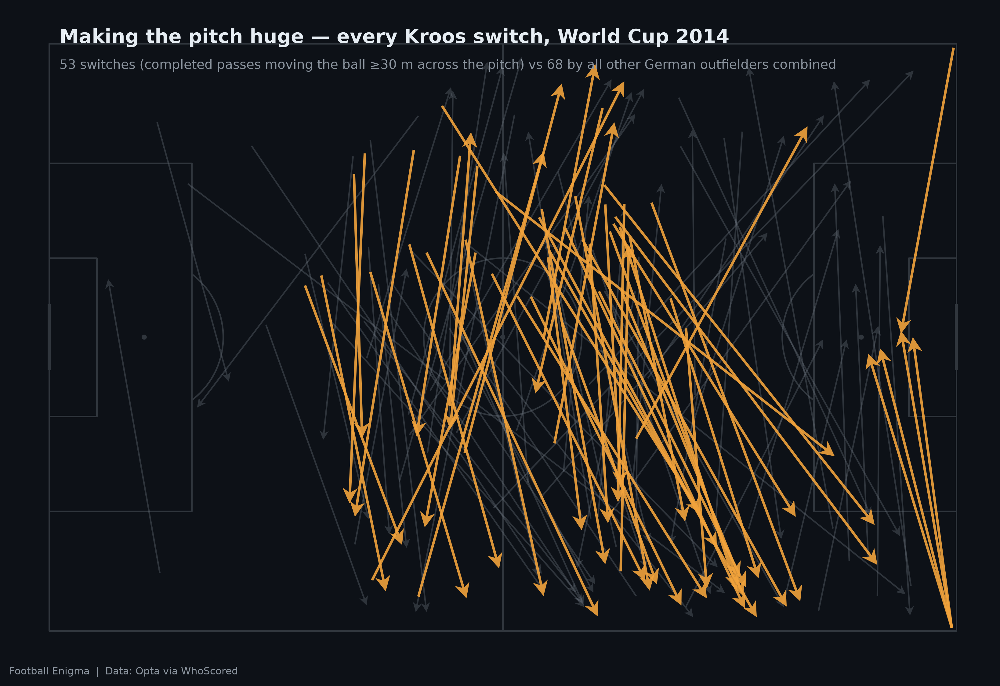
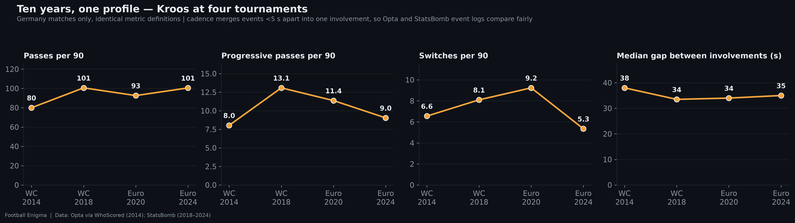
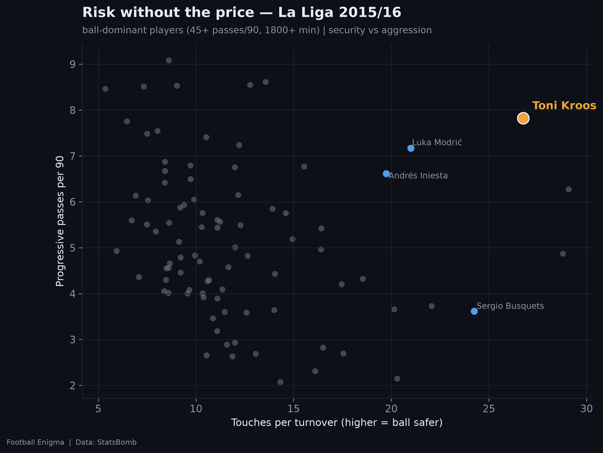
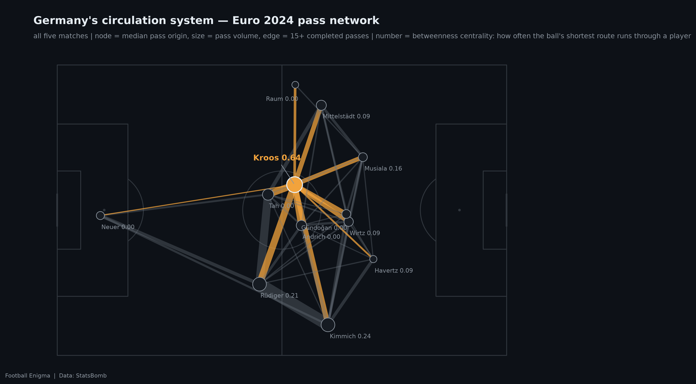

<div align="center">

# ⚽ Football Enigma

### _Mismeasured, not underrated._

**Data-driven profiles of football's statistical outliers — the players whose genius lives _between_ the numbers.**


&nbsp;
&nbsp;
&nbsp;
&nbsp;

<br>



<sub>Every Kroos switch of play at the 2014 World Cup (amber) against every other German outfielder _combined_ (grey).</sub>

</div>

---

> Each post pairs a narrative with metrics computed from **raw event data** —
> every claim backed by a figure generated from code in this repo. The method
> is one line: **keep the claim, change the instrument.**

## The idea

Some players are outliers only on an axis nobody plots. Standard passing
numbers — volume, completion % — rank Toni Kroos with the pack. Build axes
for the things those instruments miss (rhythm, geography, risk-free
progression, centrality) and the pack chart detonates into a single dot,
off the scale, in whichever direction you point it. Every instrument here is
defined in the open, unit-tested, and reproducible from this repo.

### Selected figures — Post #1, Toni Kroos

<table>
<tr>
<td width="33%"></td>
<td width="33%"></td>
<td width="33%"></td>
</tr>
<tr>
<td align="center"><sub>Ten years, four tournaments,<br>identical metrics — the rhythm never ages</sub></td>
<td align="center"><sub>Forward aggression vs ball security:<br>everyone trades one for the other, except one dot</sub></td>
<td align="center"><sub>Germany's circulation system —<br>nearly everything routed through one junction</sub></td>
</tr>
</table>

## Structure

```
football_enigma/   shared installable package (pip install -e .)
  data/            loaders + canonical event schema (105×68 m coordinates)
  metrics/         xT (inline), packing (360), pressure, aggregates,
                   cadence, tempo, pass networks  — all unit-tested
  viz/             house style, pitch wrappers, signature charts
players/<slug>/    per-player notebooks, figures, sources
tests/             metric + schema unit tests
```

> **Note:** the cached event data (`data/`) and the written blog drafts
> (`players/*/blog/`) are intentionally **not** in this repo — the data is
> regenerable from source, and the essays are published elsewhere. What ships
> here is the **code and the figures**.

## Setup

```bash
py -3.13 -m venv .venv
.venv/Scripts/pip install -e ".[dev]"
.venv/Scripts/python -m pytest tests/                        # metric + schema tests
.venv/Scripts/python -X utf8 players/toni-kroos/run_all.py   # regenerate every figure
```

WhoScored scraping additionally needs Chrome installed (Selenium, visible
window); all pulls cache locally so they run once.

## Data sources & attribution

- **StatsBomb open data** — tournament event data + 360 freeze-frames. Free
  for non-commercial research with attribution: **Data: StatsBomb**.
- **Opta via WhoScored** — full-career event data (scraped politely and
  cached locally; only derived figures and aggregates are published, never
  raw events).
- Non-commercial portfolio project.

## Method notes

- All coordinates are canonicalised to a **105×68 m pitch** so distances are
  real meters across providers.
- **xT** is implemented from scratch (Karun Singh grid formulation) and
  unit-tested — see `football_enigma/metrics/xt.py`.
- **Packing** counts from 360 freeze-frames are **lower bounds**
  (camera-visible players only) — stated wherever shown.
- **Cadence** merges on-ball events under 5 s apart into one involvement, so
  Opta and StatsBomb event logs compare fairly.
- Metric definitions (progressive pass, switch, final-third entry, …) are
  documented in `football_enigma/metrics/aggregates.py`.

<div align="center">
<br>
<sub>Non-commercial portfolio project · figures are derived aggregates · no raw data redistributed</sub>
</div>
